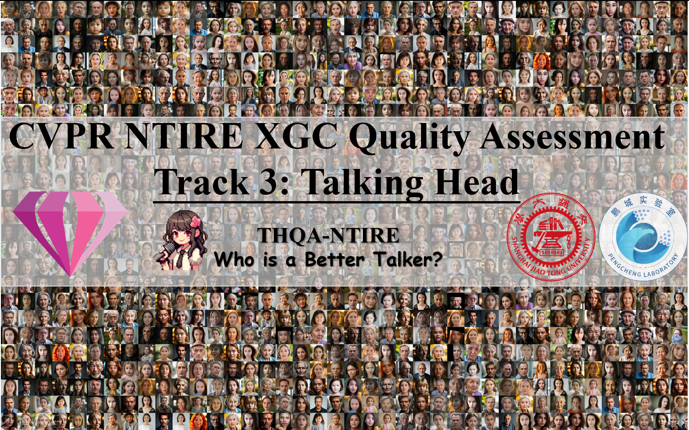

# 
🚀 CVPR NTIRE 2025 - XGC Quality Assessment - Track 3: Talking Head (THQA-NTIRE)
 
##  
 <i>"Who is a Better Talker?"</i>
 
 
 <strong><em>Supervisors:</em></strong>  <a href="">Xiaohong Liu</a>1,  <a href="">Xiongkuo Min</a>1,   <a href="">Guangtao Zhai</a>1,    <a href="">Jie Guo</a>2,  <a href="">Radu Timofte</a>    <strong><em>Student Organizers:</em></strong> <a href="">Yingjie Zhou</a>1,  <a href="">Zicheng Zhang</a>1,  <a href="">Farong Wen</a>1,  <a href="">Yanwei Jiang</a>1,  <a href="">XiLei Zhu</a>1,  <a href="">Li Xu</a>2,  <a href="">Jun Jia</a>1,  <a href="">Wei Sun</a>1     Email: Yingjie Zhou (zyj2000@sjtu.edu.cn)     1Shanghai Jiao Tong University   2PengCheng Laboratory     <i><strong><a href='https://codalab.lisn.upsaclay.fr/competitions/21555' target='_blank'>CVPR NTIRE 2025 XGC Quality Assessment - Track 3: Talking Head</a></strong></i>

<!-- Organized by Shanghai Jiao Tong University and Pengcheng Laboratory  -->

 

## 🎉 Congratulation：

 
| Rank | Team | Score | SRCC | PLCC |
| ------ |---------|---------|---------|---------|
| 1 | QA Team | 0.8245 | 0.8036 | 0.8453 |
| 2 | MediaForensics | 0.8236 | 0.8024 | 0.8448 |
| 3 | AutoHome AIGC | 0.8047 | 0.7864 | 0.8229 |
| 4 | USTC-AC | 0.8044 | 0.7813 | 0.8275 |
| 5 | SJTU-MOE-AI | 0.8003 | 0.7797 | 0.8209 |
| 6 | FocusQ | 0.7922 | 0.7708 | 0.8135 |
| 7 | NJUST-KMG | 0.7896 | 0.7599 | 0.8193 |
| 8 | XIDIAN-VQATeam | 0.7873 | 0.7730 | 0.8015 |
| 9 | LVGroup_HFUT | 0.3049 | 0.3082 | 0.3015 |
 
 
 
## 🎉 Update: Test Stage Begin
 
[HuggingFace](https://huggingface.co/datasets/zyj2000/THQA-NTIRE/tree/main) | [百度网盘: test.zip](https://pan.baidu.com/s/12AHOUJSEpwCL0LS25fwdwA?pwd=thqa) | [Github: thqa_ntire_testlist.csv](https://github.com/zyj-2000/THQA-NTIRE/blob/main/thqa_ntire_testlist.csv)

## 🎉 Motivation

    &nbsp;&nbsp;&nbsp;&nbsp;In the field of media technology, digital humans have garnered significant attention due to rapid advancements in computer graphics and artificial intelligence. These technological developments have facilitated the emergence of immersive communication, a novel paradigm that enhances conversational experiences through the transmission of talking heads. While numerous speech-driven methods for synthesizing talking head (TH) videos have been proposed, the suboptimal quality of many generated outputs remains a critical concern, adversely impacting user visual experiences. Consequently, quality assessment of synthesized talking heads has emerged as a pivotal research challenge. Establishing effective quality assessment methods to accurately predict TH video quality is imperative to advance digital human media development and optimize human-digital interaction experiences.

    &nbsp;&nbsp;&nbsp;&nbsp;Jointly with the NTIRE workshop, we have an NTIRE challenge on talking head video quality assessment, that is, the task of predicting the perceptual quality of a talking head video based on a set of prior examples of talking head video and their perceptual quality labels. The aim is to obtain a network design/solution capable of producing high-quality results with the best correlation to the reference ground truth (i.e., Mean Opinion Score, MOS).

    &nbsp;&nbsp;&nbsp;&nbsp;This track uses a new dataset called Quality Assessment Dataset for Talking Heads Quality Assessment(THQA). The dataset contains in total of 12,247 Talking Heads videos. Specifically, the training set contains 8,927 Talking Head videos, with the validation set 1,714 and the test set 1,606. All sets follow the same rating procedure as the training set. More details are found in the "get data" section of the competition, under the "participate" tab.

    &nbsp;&nbsp;&nbsp;&nbsp;The top-ranked participants will be awarded and invited to follow the CVPR submission guide for workshops to describe their solutions and to submit to the associated NTIRE workshop at CVPR 2025.

## 🔥 Update
- 2025.02.08 - 🎉 Submission formats and baseline are released.
- 2025.02.04 - 💻 CodaLab is released.
- 2025.02.03 - 🎉 NTIRE-Dataset released.
- 2025.02.03 - 🛳️ This repo is released.

## 📅 TODO

- [ ] **Release Dataset (test).**
- [ ] **Release Competition Result.**
- [x] **Release Dataset (train and val).**
- [x] **Release Homepage.**
- [x] **Release CodaLab.**

## 👀 demo

 

 

 

 
 

## 🛳️ Related Works
[ICIP24] [THQA: A Perceptual Quality Assessment Database for Talking Heads](https://arxiv.org/abs/2404.09003) | [GitHub](https://github.com/zyj-2000/THQA)

[MM24] [Subjective and Objective Quality-of-Experience Assessment for 3D Talking Heads](https://dl.acm.org/doi/10.1145/3664647.3680964) | [GitHub](https://github.com/zyj-2000/THQA-3D)

## Dataset Access:

[Huggingface: All in one](https://huggingface.co/datasets/zyj2000/THQA-NTIRE/tree/main) | [百度网盘: train.zip](https://pan.baidu.com/s/1sCk5y4FFm5QwW4VhZojDAQ?pwd=thqa) | [百度网盘: val.zip](https://pan.baidu.com/s/1MSZq0Ol-pbVdJ5HqDjJ96g?pwd=thqa) | [Github: thqa_ntire_train.csv](https://github.com/zyj-2000/THQA-NTIRE/blob/main/thqa_ntire_train.csv) | [Github: thqa_ntire_vallist.csv](https://github.com/zyj-2000/THQA-NTIRE/blob/main/thqa_ntire_vallist.csv)

## Other Files:

[Baseline and Submission Example (Score=0.7892)](https://github.com/zyj-2000/THQA-NTIRE/blob/main/baseline_example.zip) 

## Wechat Group (微信群):
The QR code on the left is for the Track 3: Talking Head group and the QR code on the right is for the XGC Quliaty Assessment （including Track 1~3）group.

 

